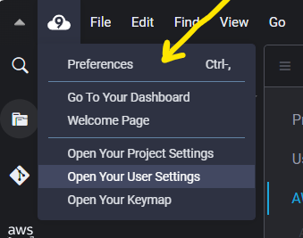
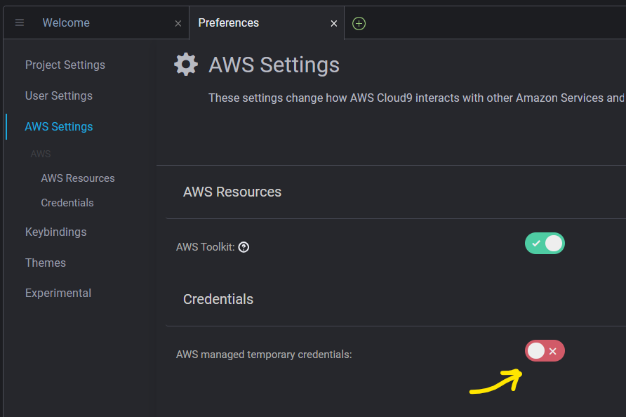
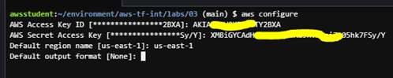
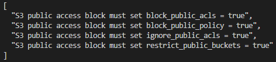
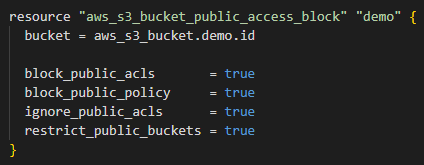

# Lab 1 – Introduction to Policy Enforcement with OPA and Terraform

© 2026 QA Michael Coulling-Green

## Overview

In this lab, you will deploy a simple AWS resource using Terraform and introduce policy enforcement using Open Policy Agent (OPA).

Terraform is responsible for defining and provisioning infrastructure. However, it does not enforce organisational standards by default. OPA is to be used to evaluate Terraform plans and ensure they comply with defined rules before deployment.

---

## Learning Objectives

By the end of this lab, you will be able to:

- Understand the difference between infrastructure provisioning and policy enforcement
- Generate a Terraform execution plan and export it as JSON
- Use OPA to evaluate a Terraform plan against policy rules
- Identify and interpret policy violations
- Modify infrastructure code to meet governance requirements

---

## Scenario

You are working within an organisation that allows teams to deploy infrastructure using Terraform.

However, all resources must comply with defined standards for:

- Naming conventions
- Ownership and environment tagging
- Security configuration

To enforce these standards, OPA is used to evaluate Terraform plans before deployment.

---

## Key Concept

Terraform answers:

> Can this infrastructure be created?

OPA answers:

> Should this infrastructure be allowed?

---

## What You Will Build

In this lab, you will:

- Define an AWS S3 bucket using Terraform
- Generate a Terraform plan
- Evaluate the plan using OPA
- Introduce a policy violation
- Observe how OPA blocks non-compliant infrastructure

---

## Lab Steps

### Step 1. Install Open Policy Agent (OPA)

OPA is not included in this repository and must be installed locally.

Follow the instructions for your operating system below.

---

### Windows

1. Open a browser and navigate to: https://openpolicyagent.org/docs/latest/#running-opa

2. Download the Windows executable (`opa_windows_amd64.exe`)

3. Rename the file to: opa.exe

4. Move the file to a known location, for example: C:\opa\opa.exe

5. (Optional but recommended) Add this location to your system PATH:

- Open **Environment Variables**
- Edit the **Path** variable
- Add: `C:\opa`

6. Verify the installation:

```powershell
opa version
```

Linux / macOS

Run the following commands:

curl -L -o opa https://openpolicyagent.org/downloads/latest/opa_linux_amd64
chmod 755 opa
sudo mv opa /usr/local/bin/opa

Verify the installation:

opa version
Expected Output

You should see version information similar to:

Version: x.x.x
Build Commit: ...
Build Timestamp: ...
Troubleshooting

If the opa command is not recognised:

Ensure the binary location is included in your PATH

Restart your terminal after updating PATH

On Linux/macOS, confirm the file is executable using chmod 755


### Step 1. Configuring Access to AWS using Cloud9/Visual Studio Code 

If using Cloud9 as your IDE: 

Cloud9 uses temporary credentials by default which do not have sufficient authorization to complete some upcoming steps. Navigate to Preferences, AWS Settings, Credentials and disable temporary credentials before following the instructions regarding 'aws configure'




For All IDEs:

Open an IDE terminal session and use “aws configure” to supply explicit lab credentials, providing the Access Key and Secret Access Key generated for your student account. Leave Default region and Default output empty





### Step 2 – Review the Terraform Configuration

You are provided with a Terraform configuration at qa-opa-labs\tf-local-opa that defines:

- An S3 bucket
- A public access block configuration with no restrictions
- A set of tags applied to the resource

At this stage, the configuration is valid and deployable.

Open an IDE terminal session at qa-opa-labs\tf-local-opa

Run the following commands:

```bash
terraform init
terraform apply --auto-approve
```
Navigate to S3 in AWS and verify the bucket is created.

Delete the bucket ahead of applying OPA governance controls

```bash
terraform destroy --auto-approve
```

### Step 3 - Review the OPA policy

Governance mandates that 

- S3 bucket names follow the required prefix (`opa-demo-`)
- Required tags are present (`Environment`, `Owner`, `ManagedBy`)
- A public access block resource is defined and all public access protection settings are enabled

Review the commented s3_guardrails.rego policy file in qa-opa-labs\lab1\policy 

This policy ensures that any S3 bucket defined within a Terraform plan adheres to the stated governance requirements.

If any of these conditions are not met, OPA adds a message to the deny list. If the deny list is empty, the Terraform plan is considered compliant.


### Step 4 – Convert a Terraform Plan to JSON and Evaluate with OPA

```bash
terraform plan -out tfplan.binary
terraform show -json tfplan.binary > tfplan.json
opa eval -f pretty -d policy -i tfplan.json "data.terraform.aws.deny"
```

Expected output:




Fix the Configuration

Update qa-opa-labs\lab1\main.tf, setting all public access block settings to true



Re-run the OPA policy to ensure compliance

```bash
terraform plan -out tfplan.binary
terraform show -json tfplan.binary > tfplan.json
opa eval -f pretty -d policy -i tfplan.json "data.terraform.aws.deny"
```

Expected outcome is [], indicating an empty deny list

### Step 5 – Challenge

Corporate governance now demands that all resources also have an ownership tag.

Update s3_guardrails.reg to reflect this change

Run OPA policy to prove current non-compliance

```bash
terraform plan -out tfplan.binary
terraform show -json tfplan.binary > tfplan.json
opa eval -f pretty -d policy -i tfplan.json "data.terraform.aws.deny"
```

Update qa-opa-labs\lab1\terraform.tfvars to make this deployment compliant.

Run OPA policy to prove compliance

```bash
terraform plan -out tfplan.binary
terraform show -json tfplan.binary > tfplan.json
opa eval -f pretty -d policy -i tfplan.json "data.terraform.aws.deny"
```

<details><summary>show solution</summary>
<p>

test

</p>
</details>


### Key Lab Takeaway

Terraform tells us what will be built.

OPA tells us whether it should be allowed.


