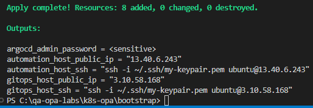

# Lab 2 – OPA with Kubernetes

© 2026 QA Michael Coulling-Green

# Lab Overview

In this lab, you will use OPA as a Gatekeeper for a Kubernetes cluster
Rather than manually building the kubernetes infrastructure, you will deploy a pre-defined environment. Having deployed the environment, you will deploy and test the OPA Gatekeeper against a development K8S cluster.

# Lab Steps

Ensure you have cloned the class repo onto your IDE machine into c:\qa-opa-labs.

Instructions assume the repo is at c:\qa-opa-labs, adjust all paths as necessary 

## 1. Create and download an AWS EC2 Key Pair 

The automated build deploys virtual machines that allow remote connectivity using a pem key. The key to be used must first be created and downloaded.

Log into the AWS console using your lab credentials

In AWS Console: EC2 → Key Pairs → Create key pair.

Key type: RSA. 

File format: .pem.

Name it "my-keypair" and download the PEM file.

Move the downloaded PEM file to your home directory .ssh folder

Fix permissions to prevent any OpenSSH issues (update with your user name)...
<p>

```bash
icacls C:\Users\YourUserName\.ssh\my-keypair.pem /inheritance:r
icacls C:\Users\YourUserName\.ssh\my-keypair.pem /grant:r "$($env:USERNAME):(R)"
```

</p>

Provision the remote environment using Terraform
<p>

```bash
cd c:\qa-opa-labs\k8s-opa\bootstrap
terraform init
terraform apply --auto-approve
```

</p>

Terraform will output the public IPs (yours will differ from those shown) of two virtual machines, a GitOps host running K8S, ArgoCD and AWX and an Automation host running Jenkins…




## 2. SSH to the GitOps Host and Verify Bootstrap

SSH to the gitops vm, by copying the quoted command in the output or by using the command below, updating gitops-public-ip with that shown in the terraform output:

</p>

```bash
ssh -i ~/.ssh/my-keypair.pem ubuntu@gitops-public-ip
```

</p>


Watch the log as the deployment progresses:

</p>

```bash
sudo tail -n 200 /var/log/kind_install.log
```

</p>

You may have to wait for logging to commence. Re-run the above command periodically as the script progresses. 

Wait until you see the completion banner indicating the bootstrap finished …
 
Once completed, confirm K8S clusters exist

</p>

```bash
sudo kind get clusters
```

</p>

Expect to see three clusters; dev, platform and prod

Confirm kubectl contexts exist

</p>

```bash
kubectl config get-contexts
```

</p>

Expect to see three contexts; kind-dev, kind-platform and kind-prod

Confirm nodes are Ready in each cluster

</p>

```bash
kubectl --context kind-platform get nodes
kubectl --context kind-dev get nodes
kubectl --context kind-prod get nodes
```

</p>

Expected to see three nodes; platform-control-plane, dev-control-plane and prod-control-plane. All nodes should be Ready
 
Cleanup (Optional)

To remove the lab infrastructure when instructed:

terraform destroy --auto-approve

Note: destroying the host will remove all kind clusters and installed controllers.
