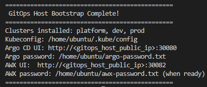
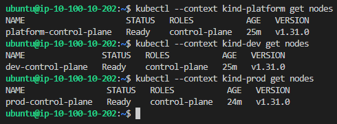
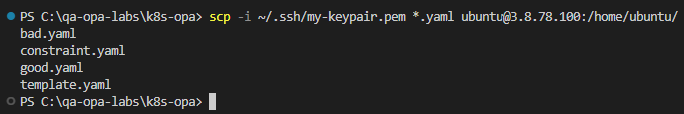
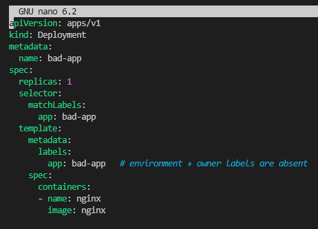
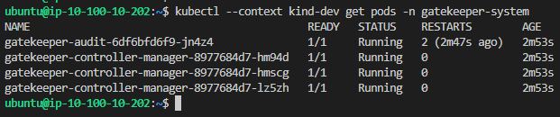

# Lab 3 – OPA with Kubernetes

© 2026 QA Michael Coulling-Green

# Lab Overview

In this lab, you will use OPA Gatekeeper for governance of a Kubernetes cluster.

Rather than manually building the kubernetes infrastructure, you will begin by deploying a pre-defined environment using Terraform. Having deployed the environment, you will then manually deploy and test OPA Gatekeeper.

# Lab Steps

## Step 1. Create and download an AWS EC2 Key Pair 

The automated build deploys virtual machines that allow remote SSH connectivity using a pem key. The key to be used must first be created and downloaded.

Log into the AWS console using your lab credentials

In AWS Console: EC2 → Key Pairs → Create key pair.

Key type: RSA. 

File format: .pem.

Name: "my-keypair" 

Download the PEM file and move it to the .ssh folder in your home directory, creating a new folder if none aready exists

Fix permissions to prevent any possible OpenSSH issues (update with your user name)...

### Set Permissions on Your Private Key

#### Windows

```powershell
icacls C:\Users\YourUserName\.ssh\my-keypair.pem /inheritance:r
icacls C:\Users\YourUserName\.ssh\my-keypair.pem /grant:r "$($env:USERNAME):(R)"
```

#### Linux / macOS
```bash
chmod 400 ~/.ssh/my-keypair.pem
```


## Step 2. Accessing AWS using Cloud9/Visual Studio Code 

THIS ENTIRE SECTION CAN BE SKIPPED IF YOU HAVE ALREADY COMPLETED LAB 1

If using Cloud9 as your IDE: 

Cloud9 uses temporary credentials by default which do not have sufficient authorization to complete some upcoming steps. Navigate to Preferences, AWS Settings, Credentials and disable temporary credentials before following the instructions regarding 'aws configure'


For All IDEs:

Open an IDE terminal session and use “aws configure” to supply explicit lab credentials, providing the Access Key and Secret Access Key generated for your student account. Leave Default region and Default output empty


## Step 3. Provision the remote environment using Terraform

In your terminal session, navigate to qa-opa-labs\lab3\bootstrap and then run...

```bash
terraform init
terraform apply --auto-approve
```

Terraform will output the public IPs (yours will differ from those shown) of two virtual machines, a GitOps host running Kubernetes, ArgoCD and AWX, and an Automation host running Jenkins. Note down the IP address assigned to your gitops_host vm as you will require it for later steps.


## 4. SSH to the GitOps Host and Verify the Bootstrap succeeds

SSH to your gitops_host vm, either by copying the quoted command shown in your output or by using the command below, updating gitops-public-ip with that shown in your terraform output:

</p>

```bash
ssh -i ~/.ssh/my-keypair.pem ubuntu@gitops-public-ip
```

</p>

Enter 'yes' if prompted to add the unknown host

Watch the log as the deployment progresses:

</p>

```bash
sudo tail -n 200 /var/log/kind_install.log
```

</p>

You may have to wait for logging to commence. Re-run the above command periodically as the script progresses. 

Repeat until you see the completion banner indicating the deployment has finished …


 
Three independent single-node Kubernetes  clusters have been provisioned using Kind (Kubernetes-in-Docker), representing development, platform, and production environments. Each cluster operates with its own isolated control plane, allowing governance and workload behaviour to be demonstrated independently across environments.

Once completed, confirm the Kubernetes clusters exist

</p>

```bash
sudo kind get clusters
```

</p>

Expect to see three clusters; dev, platform and prod

Confirm kubectl contexts exist

</p>

```bash
kubectl config get-contexts
```

</p>

Expect to see three contexts; kind-dev, kind-platform and kind-prod

Confirm nodes are Ready in each cluster

```bash
kubectl --context kind-platform get nodes
kubectl --context kind-dev get nodes
kubectl --context kind-prod get nodes
```

Expected to see three nodes; platform-control-plane, dev-control-plane and prod-control-plane. All nodes should show as Ready



The base lab environment is now deployed, but without Kubernetes policy enforcement enabled.

Focussing on the Development cluster, you will now compare Kubernetes behaviour before and after policy enforcement is introduced.

First, a non-compliant workload will be deployed successfully, demonstrating that the cluster accepts resources without validation by default. After removing the workload, OPA Gatekeeper will be installed and a policy applied requiring mandatory labelling of resources.

When the same workload deployment attempt is made, it should be rejected by the cluster, demonstrating how OPA enforces governance at the admission level, preventing non-compliant resources from being created.


## 5. Copy Kubernetes manifest files to gitop host

Without closing your existing ssh session, open a new IDE terminal session using Ctrl+Shift+'

Navigate to qa-ops-labs\lab2

Run the following, updating gitop-public-ip with your gitop host public ip


```
scp -i ~/.ssh/my-keypair.pem *.yaml ubuntu@gitop-pubic-ip:/home/ubuntu/
```

</p>





## 6. Test an Unvalidated deployment
Switch back your SSH session terminal and then open bad.yaml


```
nano bad.yaml
```

Note that the Deployment is lacking an environment label



Use Ctrl+x to exit nano

Deploy bad-app

```
kubectl --context kind-dev apply -f bad.yaml
```

Verify the deployment succeeded

```
kubectl --context kind-dev get deployment,pod
```

Delete the bad-app deployment

```
kubectl --context kind-dev delete deployment bad-app
```


## 7. Deploy Gatekeeper

</p>

```bash
kubectl --context kind-dev apply --server-side \
  -f https://raw.githubusercontent.com/open-policy-agent/gatekeeper/release-3.16/deploy/gatekeeper.yaml
```

</p>

Verify the deployment

</p>

```bash
kubectl --context kind-dev get pods -n gatekeeper-system
```

</p>




## 8. Constraint Template and Constraint Overview

Gatekeeper enforces policy through two key components: Constraint Templates and Constraints.

The Constraint Template defines the policy logic itself. It contains the Rego code used by OPA to evaluate Kubernetes resources. In this lab, the template defines a rule that checks whether specific labels are present on a resource.

The Constraint is an instance of that template. It specifies how and where the policy should be applied within the cluster. In this case, the constraint applies the label-checking rule to Kubernetes workloads such as Deployments.

Review your local copies of template.yaml and constraint.yaml in c:\qa-opa-labs\lab3 

What This Policy Is Doing: 

For this lab, the policy enforces a simple but realistic governance rule: all workloads must include the labels 'app' and 'environment'. These labels are commonly used in real-world environments to support cost allocation, and environment classification. If either of these labels are missing, the request to create or modify the resource will be denied at admission time.

Apply the Constraint Template, thus installing the policy logic into the cluster. At this stage, no enforcement occurs yet.

</p>

```bash
kubectl --context kind-dev apply -f template.yaml
```

</p>

Apply the Constraint, thus activating the policy by applying it to the cluster. From this point onward, any workload that does not meet the defined requirements will be rejected.

</p>

```bash
kubectl --context kind-dev apply -f constraint.yaml
```

</p>


## 9. Testing OPA Gatekeeper

First you will apply a manifest that complies with governance requirements.

Review good.yaml

</p>

```bash
nano good.yaml
```

</p>

Use Ctrl+x to exit nano

Apply the good manifest and verify success

</p>

```bash
kubectl --context kind-dev apply -f good.yaml
kubectl --context kind-dev get deployment,pod
```

</p>


Apply the bad manifest and verify failure

</p>

```bash
kubectl --context kind-dev apply -f bad.yaml
```

</p>

Use nano to edit bad.yaml, adding an evironment label at the Deployment level. Save changes using Ctrl+x, type 'Y' and press Enter

Retest the deployment, it should now succeed:

</p>

```bash
kubectl --context kind-dev apply -f bad.yaml
kubectl --context kind-dev get deployment,pod
```

</p>

Clean up by deleting the good-app and bad-app deployments

</p>

```bash
kubectl --context kind-dev delete deployment good-app
kubectl --context kind-dev delete deployment bad-app
```

</p>

## 10. Challenge. Modify and test the Gatekeeper template  

The Governance Team has mandated that resource ownership must also be included as part of Deployment labelling. Your task is to update the Gateway template.yaml to include a check for this label. Redeploy the template and verify it by attempting to deploy good-app and bad-app again. Both should fail the new governance check given that they lack ownership labelling. Update the two deployments with ownership labelling so that they can be successfully deloyed. 

Tidy up by deleting any deployed resources.


## 11. Lab Teardown

To remove the lab infrastructure, switch to your local terminal session

Navigate to qa-opa-labs/lab3

</p>

```bash
terraform destroy --auto-approve
```
</p>

